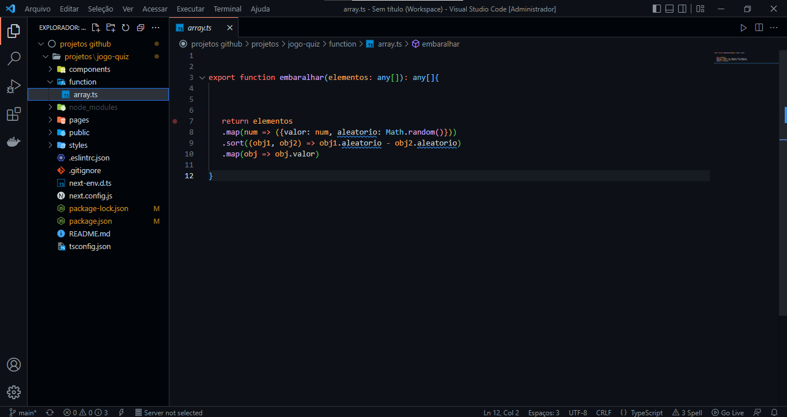

<h2>Projeto Quiz de perguntas e respostas, Nesse projeto foi utilizado:</h2>

<ul>
  <li>React</li>
  <li>Next.js</li>
  <li>JavaScript</li>
  <li>Html</li>
  <li>Css</li>
  <li>Typescript</li>
</ul>

 

<h2>********************* Dependências *********************</h2> 

npx create-next-app jogo-quiz

npm install --save-dev @types/react@18.0.1

<h2>Entendendo o Projeto</h2>

 
O projeto é um jogo de perguntas e respostas, ao iniciar o jogo você tem uma pergunta com 4 opções de respostas e 10s para responder ao total são 16 perguntas, você pode responder e esperar o tempo acaba que ele irá passa para a próxima pergunta ou pode da um clique no botão próxima que ele passa para a próxima pergunta.

Ao finalizar as 16 perguntas você irá para uma página que mostrar dados, de quantas perguntas você respondeu
a quantidade de acertos e a porcentagem.

Nessa tela também tem um botão para reiniciar o jogo.

<h2>Arquivos do Projeto</h2>

<h2>Todos os arquivos que compõem o projeto</h2>

<h2>Pasta components</h2>

Pasta components: Todos os arquivos relativo a interface da aplicação

<h2>Pasta function</h2>

Pasta function: possuí um único arquivo com a logica responsável pra gerar um id aleatorio 

<h2>Pasta pages</h2>

Pasta page: possuí possuí outras pastas dentro dela pasta API, pasta QUESTOES, Pasta MODEL e alguns arquivos

Pasta QUESTOES: dentro dessa pasta temos 2 arquivos [id] e bandoDeQuestoes  

Pasta MODEL: dentro da pasta MODEL temos 2 arquivos quetoes e respostas

Arquivo index.tsx: retornar todas as perguntas selecionada do bandoDeQuestoes e embaralha e recebe a função que embaralha as respostas 

Arquivo resultado.tsx: arquivo que contem a logica que informa o resultado final do game

<h2>Pasta styles</h2>

Pasta function: possuí todos os arquivos refente a css do projeto 

<h2>O game</h2>

Imagens do jogo em funcionamento 

<h2>O resultado no fim do game</h2>

Imagens do resultado no fim do game 

